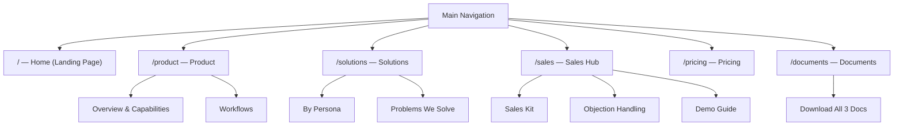

# POS SaaS Documentation Website — Master Plan

---

## 1. Summary of the 3 Markdown Files

### File A — `MARKETING_PRODUCT_BUSINESS_OVERVIEW.md` (347 lines)
| Aspect | Detail |
|---|---|
| **Content type** | Deep product documentation — executive summary, ideal customers, every core capability with "why it matters" blocks, 7 real-world workflows, feature-to-benefit table, competitive positioning, sales talking points, and assumptions/validation notes |
| **Tone** | Informational, objective, slightly internal-facing |
| **Best suited for** | Product capability pages, workflow/use-case showcase, feature-benefit comparison page, internal reference |
| **Key sections** | Executive Summary · Ideal Customer Types · 10 Core Business Capabilities (each with detail + "why it matters") · 7 Real Customer Workflows · Key Selling Points · Feature-to-Benefit Table · Competitive Positioning · Sales Talking Points · Assumptions & Validation |

### File B — `POS_SAAS_PITCH_DECK_10_SLIDES.md` (103 lines)
| Aspect | Detail |
|---|---|
| **Content type** | Presentation-style pitch deck — 10 concise slides covering problem, solution, audience, value, capabilities, use cases, sales messages, packaging, and closing |
| **Tone** | Punchy, persuasive, high-level |
| **Best suited for** | Landing page hero, overview sections, problem/solution narrative, pricing tier preview, visual presentation page |
| **Key sections** | Title · Problem · Solution · Who It's For · Core Value · Key Capabilities · Real Use Cases · Why It Sells · Packaging Strategy · Closing |

### File C — `POS_SAAS_SALES_READY_PACK.md` (231 lines)
| Aspect | Detail |
|---|---|
| **Content type** | Sales enablement playbook — elevator pitch, personas, problems solved, selling points, feature→benefit→sales-angle table, conversation hooks, demo script, objection handling, competitive positioning, packaging, closing lines |
| **Tone** | Action-oriented, conversational, sales-team facing |
| **Best suited for** | Sales-ready page, FAQ/objection handling, persona showcase, demo walkthrough, downloadable resource |
| **Key sections** | Elevator Pitch · 30-sec Summary · 5 Target Personas · 8 Business Problems Solved · 12 Key Selling Points · Feature→Benefit→Sales Angle Table · 7 Conversation Hooks · 8-Step Demo Script · 8 Objection Handlers · Competitive Positioning · Packaging · Closing Lines |

### Content Overlap & Uniqueness Matrix

| Topic | File A | File B | File C | Recommended Primary Source |
|---|---|---|---|---|
| Executive / elevator summary | ✅ | ✅ | ✅ | **B** for hero, **C** for one-liner |
| Problem statement | — | ✅ | ✅ | **B** (slide format) |
| Ideal customers / personas | ✅ (list) | ✅ (list) | ✅ (detailed personas) | **C** for personas, **A** for categories |
| Core capabilities (deep) | ✅ (10 sections) | ✅ (summary) | — | **A** (authoritative detail) |
| Workflows | ✅ (7 workflows) | ✅ (5 use cases) | ✅ (demo script) | **A** for workflows, **C** for demo |
| Feature-benefit mapping | ✅ (table) | — | ✅ (table + sales angle) | **A** for product page, **C** for sales page |
| Selling points | ✅ | ✅ | ✅ | **C** (most actionable) |
| Objection handling | — | — | ✅ | **C** (unique) |
| Packaging / pricing tiers | — | ✅ | ✅ | **C** (more detail) |
| Competitive positioning | ✅ | — | ✅ | **A** + **C** combined |
| Assumptions / validation | ✅ | — | — | **A** (unique) |

---

## 2. Recommended Website Structure / Sitemap



### Page Breakdown

| Route | Page Title | Primary Content Source | Purpose |
|---|---|---|---|
| `/` | Home (Landing) | **B** slides 1-5 + **C** one-liner + **A** executive summary | First impression: problem → solution → value → CTA |
| `/product` | Product | **A** sections 3-6 (all 10 capabilities, feature-benefit table) | Deep product capability showcase |
| `/solutions` | Solutions | **C** sections 3-4 (personas + problems solved) + **A** section 2 (ideal customers) | Persona-driven "is this for me?" page |
| `/sales` | Sales Hub | **C** sections 5-9 (selling points, conversation hooks, demo script, objections) + **B** slides 8-9 | Internal sales team resource + client-shareable |
| `/pricing` | Pricing | **B** slide 9 + **C** section 11 (packaging strategy) | Tier comparison |
| `/documents` | Documents | Links to all 3 original `.md` files | Download / view raw source documents |

### Navigation Structure
```
Logo  ·  Home  ·  Product  ·  Solutions  ·  Sales Hub  ·  Pricing  ·  Documents  ·  [Theme Toggle]  ·  [Get Started CTA]
```

---

## 3. Wireframe for Each Page

### 3.1 Home Page (`/`)

```
┌──────────────────────────────────────────────────────────┐
│  NAVBAR  [Logo]  Home · Product · Solutions · Sales · Pricing · Docs  [🌙] [Get Started]  │
├──────────────────────────────────────────────────────────┤
│                                                          │
│  ╔══════════════════════════════════════════════════════╗ │
│  ║  HERO SECTION                                       ║ │
│  ║  Headline: "NSL POS That Helps Businesses        ║ │
│  ║            Sell, Control Stock, and Grow"            ║ │
│  ║  Sub-headline: One-liner from Sales Pack             ║ │
│  ║  [Explore Product]  [View Pricing]                  ║ │
│  ║  ───── Animated abstract POS illustration ─────     ║ │
│  ╚══════════════════════════════════════════════════════╝ │
│                                                          │
│  ┌─── Problem Section (Pitch Deck Slide 2) ───────────┐ │
│  │  "Retail Businesses Outgrow Basic POS Fast"         │ │
│  │  5 pain-point cards with icons                      │ │
│  │  [Sales separate from stock] [Excel errors]         │ │
│  │  [Multi-store blind spots] [Manual promos]          │ │
│  │  [No visibility]                                    │ │
│  └────────────────────────────────────────────────────┘ │
│                                                          │
│  ┌─── Solution Section (Pitch Deck Slide 3) ──────────┐ │
│  │  "One System to Run Daily Retail Operations"        │ │
│  │  5 solution bullets → icon + short text grid        │ │
│  └────────────────────────────────────────────────────┘ │
│                                                          │
│  ┌─── Core Value Grid (Pitch Deck Slide 5) ───────────┐ │
│  │  6 benefit cards — icon + headline + one-liner      │ │
│  │  Faster checkout · Stock visibility · Fewer errors  │ │
│  │  Easier promos · Better returns · More control      │ │
│  └────────────────────────────────────────────────────┘ │
│                                                          │
│  ┌─── Who It's For (Pitch Deck Slide 4) ──────────────┐ │
│  │  5 audience segments as horizontal scroll cards     │ │
│  └────────────────────────────────────────────────────┘ │
│                                                          │
│  ┌─── CTA Banner ─────────────────────────────────────┐ │
│  │  "One retail system to help businesses sell better  │ │
│  │   today and scale better tomorrow."                 │ │
│  │  [Get Started]  [View Sales Kit →]                  │ │
│  └────────────────────────────────────────────────────┘ │
│                                                          │
│  FOOTER  Links · Copyright · Theme credit               │
└──────────────────────────────────────────────────────────┘
```

### 3.2 Product Page (`/product`)

```
┌──────────────────────────────────────────────────────────┐
│  NAVBAR                                                  │
├──────────────────────────────────────────────────────────┤
│                                                          │
│  ╔══════════════════════════════════════════════════════╗ │
│  ║  PAGE HERO                                          ║ │
│  ║  "Everything Your Retail Business Needs"            ║ │
│  ║  Sub: Executive Summary from File A                 ║ │
│  ╚══════════════════════════════════════════════════════╝ │
│                                                          │
│  ┌────────┐  ┌──────────────────────────────────────┐   │
│  │ STICKY │  │  CAPABILITY SECTIONS (10 blocks)     │   │
│  │ SIDEBAR│  │                                      │   │
│  │        │  │  Each block:                         │   │
│  │ • Biz  │  │  ┌──────────────────────────────┐    │   │
│  │ • Store│  │  │ Icon + Title                  │    │   │
│  │ • Prod │  │  │ Detail bullets                │    │   │
│  │ • Inv  │  │  │ "Why it matters" callout box  │    │   │
│  │ • Price│  │  └──────────────────────────────┘    │   │
│  │ • Sales│  │                                      │   │
│  │ • Ret  │  │  ... repeated for all 10 ...        │   │
│  │ • Cust │  │                                      │   │
│  │ • Staff│  │                                      │   │
│  │ • Rpt  │  │                                      │   │
│  │ • Cash │  │                                      │   │
│  └────────┘  └──────────────────────────────────────┘   │
│                                                          │
│  ┌─── Feature-to-Benefit Table (File A §6) ───────────┐ │
│  │  Responsive table / card grid                       │ │
│  │  Feature · What customer can do · Benefit · Who     │ │
│  └────────────────────────────────────────────────────┘ │
│                                                          │
│  ┌─── Workflows / How It Works (File A §4) ───────────┐ │
│  │  7 workflow accordion/timeline blocks               │ │
│  │  Each: numbered steps + business outcome callout    │ │
│  └────────────────────────────────────────────────────┘ │
│                                                          │
│  CTA Banner → "See Pricing" / "Explore Solutions"       │
│  FOOTER                                                  │
└──────────────────────────────────────────────────────────┘
```

### 3.3 Solutions Page (`/solutions`)

```
┌──────────────────────────────────────────────────────────┐
│  NAVBAR                                                  │
├──────────────────────────────────────────────────────────┤
│                                                          │
│  ╔══════════════════════════════════════════════════════╗ │
│  ║  PAGE HERO                                          ║ │
│  ║  "Built for How You Actually Run Your Store"        ║ │
│  ╚══════════════════════════════════════════════════════╝ │
│                                                          │
│  ┌─── Persona Cards (File C §3) ──────────────────────┐ │
│  │  5 persona cards in 2-column grid                   │ │
│  │  Each card:                                         │ │
│  │    Avatar icon · Persona title                      │ │
│  │    "Current problem" in muted callout               │ │
│  │    "Why they need this" in accent callout            │ │
│  └────────────────────────────────────────────────────┘ │
│                                                          │
│  ┌─── Problems We Solve (File C §4) ──────────────────┐ │
│  │  8 problem→solution pairs                           │ │
│  │  Alternating layout: icon-left / icon-right         │ │
│  │  Problem as question, solution as answer            │ │
│  └────────────────────────────────────────────────────┘ │
│                                                          │
│  ┌─── Ideal Customer Fit (File A §2) ─────────────────┐ │
│  │  Retail category tags / pill badges                 │ │
│  │  Apparel · Footwear · Beauty · Home · General       │ │
│  └────────────────────────────────────────────────────┘ │
│                                                          │
│  ┌─── Real Business Use Cases (Pitch Deck Slide 7) ───┐ │
│  │  5 scenario cards with icons                        │ │
│  └────────────────────────────────────────────────────┘ │
│                                                          │
│  CTA Banner → "View Product" / "Talk to Sales"          │
│  FOOTER                                                  │
└──────────────────────────────────────────────────────────┘
```

### 3.4 Sales Hub Page (`/sales`)

```
┌──────────────────────────────────────────────────────────┐
│  NAVBAR                                                  │
├──────────────────────────────────────────────────────────┤
│                                                          │
│  ╔══════════════════════════════════════════════════════╗ │
│  ║  PAGE HERO                                          ║ │
│  ║  "Sales Ready Pack"                                 ║ │
│  ║  Sub: Quick product summary from File C             ║ │
│  ╚══════════════════════════════════════════════════════╝ │
│                                                          │
│  ┌─── TABBED CONTENT ─────────────────────────────────┐ │
│  │                                                     │ │
│  │  [Selling Points] [Conversations] [Demo] [FAQ]      │ │
│  │                                                     │ │
│  │  Tab 1: Key Selling Points (File C §5)              │ │
│  │    12 points as checkmark list with emphasis         │ │
│  │                                                     │ │
│  │  Tab 2: Conversation Hooks (File C §7)              │ │
│  │    7 "If they say → You say" cards                  │ │
│  │    Chat-bubble style UI                             │ │
│  │                                                     │ │
│  │  Tab 3: Demo Guide (File C §8)                      │ │
│  │    8-step numbered timeline                         │ │
│  │    "What to show" + "What to say" for each step     │ │
│  │                                                     │ │
│  │  Tab 4 — Objection Handling (File C §9)             │ │
│  │    8 accordion FAQ blocks                           │ │
│  │    Objection as question, response as answer        │ │
│  └────────────────────────────────────────────────────┘ │
│                                                          │
│  ┌─── Feature → Benefit → Sales Angle Table ──────────┐ │
│  │  (File C §6) responsive table                       │ │
│  └────────────────────────────────────────────────────┘ │
│                                                          │
│  ┌───Competitive Positioning (File C §10) ────────────┐ │
│  │  Best for / Best stage / Replaces / Do not target   │ │
│  │  4-column card grid                                 │ │
│  └────────────────────────────────────────────────────┘ │
│                                                          │
│  ┌─── Sales Closing Lines (File C §12) ───────────────┐ │
│  │  Inspirational quote carousel / marquee             │ │
│  └────────────────────────────────────────────────────┘ │
│                                                          │
│  CTA Banner → "Download Sales Pack" / "View Documents"  │
│  FOOTER                                                  │
└──────────────────────────────────────────────────────────┘
```

### 3.5 Pricing Page (`/pricing`)

```
┌──────────────────────────────────────────────────────────┐
│  NAVBAR                                                  │
├──────────────────────────────────────────────────────────┤
│                                                          │
│  ╔══════════════════════════════════════════════════════╗ │
│  ║  PAGE HERO                                          ║ │
│  ║  "Simple Plans That Grow With Your Business"        ║ │
│  ╚══════════════════════════════════════════════════════╝ │
│                                                          │
│  ┌─── 3-Tier Pricing Cards ───────────────────────────┐ │
│  │                                                     │ │
│  │  ┌─────────┐  ┌─────────────┐  ┌─────────┐        │ │
│  │  │ STARTER │  │   GROWTH    │  │ ADVANCED│        │ │
│  │  │         │  │  (Popular)  │  │         │        │ │
│  │  │ For     │  │  For multi- │  │ For     │        │ │
│  │  │ single  │  │  store      │  │ mature  │        │ │
│  │  │ store   │  │  businesses │  │ retail  │        │ │
│  │  │         │  │             │  │         │        │ │
│  │  │ • POS   │  │ • All Start │  │ • All   │        │ │
│  │  │ • Prod  │  │ • Multi-loc │  │   Growth│        │ │
│  │  │ • Stock │  │ • Transfers │  │ • Deep  │        │ │
│  │  │ • Cust  │  │ • Promos   │  │   report│        │ │
│  │  │ • Rpt   │  │ • Loyalty  │  │ • Prem  │        │ │
│  │  │         │  │ • Richer   │  │   support│       │ │
│  │  │         │  │             │  │         │        │ │
│  │  │ Sales   │  │ Sales angle │  │ Sales   │        │ │
│  │  │ angle   │  │ quote       │  │ angle   │        │ │
│  │  │ quote   │  │             │  │ quote   │        │ │
│  │  └─────────┘  └─────────────┘  └─────────┘        │ │
│  └────────────────────────────────────────────────────┘ │
│                                                          │
│  ┌─── "Why Customers Buy" section (Pitch Slide 10) ──┐ │
│  │  6 closing points as icon + text grid               │ │
│  │  Closing tagline in large type                      │ │
│  └────────────────────────────────────────────────────┘ │
│                                                          │
│  CTA Banner → "Get Started"                              │
│  FOOTER                                                  │
└──────────────────────────────────────────────────────────┘
```

### 3.6 Documents Page (`/documents`)

```
┌──────────────────────────────────────────────────────────┐
│  NAVBAR                                                  │
├──────────────────────────────────────────────────────────┤
│                                                          │
│  ╔══════════════════════════════════════════════════════╗ │
│  ║  PAGE HERO                                          ║ │
│  ║  "Source Documents"                                 ║ │
│  ║  Sub: Access the original documentation             ║ │
│  ╚══════════════════════════════════════════════════════╝ │
│                                                          │
│  ┌─── Document Cards (3 cards) ───────────────────────┐ │
│  │                                                     │ │
│  │  ┌──────────────────────────────────────────────┐   │ │
│  │  │  📄 Marketing & Product Business Overview    │   │ │
│  │  │  Comprehensive product documentation...      │   │ │
│  │  │  347 lines · Capabilities · Workflows        │   │ │
│  │  │  [View Online] [Download .md]                │   │ │
│  │  └──────────────────────────────────────────────┘   │ │
│  │                                                     │ │
│  │  ┌──────────────────────────────────────────────┐   │ │
│  │  │  🎯 Pitch Deck (10 Slides)                   │   │ │
│  │  │  Presentation-ready pitch deck...            │   │ │
│  │  │  103 lines · Problem · Solution · Pricing    │   │ │
│  │  │  [View Online] [Download .md]                │   │ │
│  │  └──────────────────────────────────────────────┘   │ │
│  │                                                     │ │
│  │  ┌──────────────────────────────────────────────┐   │ │
│  │  │  💼 Sales Ready Pack                         │   │ │
│  │  │  Complete sales enablement playbook...       │   │ │
│  │  │  231 lines · Personas · Objections · Demo    │   │ │
│  │  │  [View Online] [Download .md]                │   │ │
│  │  └──────────────────────────────────────────────┘   │ │
│  └────────────────────────────────────────────────────┘ │
│                                                          │
│  FOOTER                                                  │
└──────────────────────────────────────────────────────────┘
```

---

## 4. Visual Design System Direction

### 4.1 Design Philosophy
- **Premium SaaS aesthetic** — clean, spacious, confident
- **Content-first** — typography-driven with strategic use of color and illustration
- **Intentional, not template-like** — every section feels purposeful for a POS/retail product
- **Dual-mode excellence** — both light and dark themes feel first-class, not afterthoughts

### 4.2 Color System

#### Light Mode
| Token | Value | Usage |
|---|---|---|
| `--bg-primary` | `#FFFFFF` | Page background |
| `--bg-secondary` | `#F8F9FC` | Alternating section backgrounds |
| `--bg-card` | `#FFFFFF` | Card surfaces |
| `--text-primary` | `#0F172A` | Headings |
| `--text-secondary` | `#475569` | Body text |
| `--text-muted` | `#94A3B8` | Captions, metadata |
| `--accent-primary` | `#6366F1` | Primary CTA, links, active states (Indigo) |
| `--accent-primary-hover` | `#4F46E5` | Hover state |
| `--accent-secondary` | `#06B6D4` | Secondary highlights (Cyan) |
| `--accent-success` | `#10B981` | Positive callouts, check marks (Emerald) |
| `--accent-warning` | `#F59E0B` | Attention callouts (Amber) |
| `--border` | `#E2E8F0` | Card borders, dividers |
| `--border-subtle` | `#F1F5F9` | Very subtle dividers |

#### Dark Mode
| Token | Value | Usage |
|---|---|---|
| `--bg-primary` | `#0B0F1A` | Page background |
| `--bg-secondary` | `#111827` | Alternating section backgrounds |
| `--bg-card` | `#1E293B` | Card surfaces |
| `--text-primary` | `#F1F5F9` | Headings |
| `--text-secondary` | `#CBD5E1` | Body text |
| `--text-muted` | `#64748B` | Captions |
| `--accent-primary` | `#818CF8` | Primary (lighter indigo for contrast) |
| `--accent-secondary` | `#22D3EE` | Secondary (lighter cyan) |
| `--border` | `#1E293B` | Borders |
| `--border-subtle` | `#1A2332` | Subtle borders |

### 4.3 Typography

| Level | Font | Size | Weight | Line Height |
|---|---|---|---|---|
| Display (hero) | **Inter** | `clamp(2.5rem, 5vw, 4rem)` | 700 | 1.1 |
| H1 (page title) | Inter | `clamp(2rem, 4vw, 3rem)` | 700 | 1.2 |
| H2 (section) | Inter | `clamp(1.5rem, 3vw, 2.25rem)` | 600 | 1.25 |
| H3 (subsection) | Inter | `1.25rem` | 600 | 1.3 |
| Body (default) | Inter | `1rem (16px)` | 400 | 1.7 |
| Body Large | Inter | `1.125rem` | 400 | 1.7 |
| Small / Caption | Inter | `0.875rem` | 400 | 1.5 |
| Code / Mono | **JetBrains Mono** | `0.875rem` | 400 | 1.6 |

> **Google Fonts import:** `Inter:wght@400;500;600;700` + `JetBrains Mono:wght@400`

### 4.4 Spacing System (8px base grid)

| Token | Value |
|---|---|
| `--space-1` | `0.25rem` (4px) |
| `--space-2` | `0.5rem` (8px) |
| `--space-3` | `0.75rem` (12px) |
| `--space-4` | `1rem` (16px) |
| `--space-6` | `1.5rem` (24px) |
| `--space-8` | `2rem` (32px) |
| `--space-12` | `3rem` (48px) |
| `--space-16` | `4rem` (64px) |
| `--space-20` | `5rem` (80px) |
| `--space-24` | `6rem` (96px) |
| `--section-padding` | `clamp(4rem, 8vw, 7rem) 0` |

### 4.5 Component Styling

| Element | Style |
|---|---|
| **Border radius** | Cards: `16px` · Buttons: `10px` · Pills/badges: `9999px` · Inputs: `8px` |
| **Shadows (light)** | Cards: `0 1px 3px rgba(0,0,0,0.04), 0 4px 16px rgba(0,0,0,0.04)` · Elevated: `0 8px 32px rgba(0,0,0,0.08)` |
| **Shadows (dark)** | Cards: `0 1px 3px rgba(0,0,0,0.2), 0 4px 16px rgba(0,0,0,0.15)` |
| **Glassmorphism** | Nav: `backdrop-filter: blur(16px); background: rgba(255,255,255,0.8)` (light) / `rgba(11,15,26,0.8)` (dark) |
| **Gradients** | Hero text gradient: `linear-gradient(135deg, var(--accent-primary), var(--accent-secondary))` · Section bg accents: radial gradients at 5% opacity |
| **Transitions** | Default: `all 0.2s ease` · Hover lift: `transform: translateY(-2px)` · Page transitions: `0.3s ease` |

### 4.6 Animation Style
- **Entrance animations:** Fade-up on scroll (staggered per element in a group)
- **Hover effects:** Subtle lift + shadow change on cards; color shift on CTAs
- **Section transitions:** Smooth slide-in from the scroll direction
- **Tab transitions:** Crossfade content
- **Avoid:** Excessive parallax, bouncy spring physics, distracting motion
- **Respect:** `prefers-reduced-motion` — disable all non-essential animation

### 4.7 Icon Approach
- **Library:** Lucide React (clean, consistent line icons)
- **Usage:** One icon per capability card, one per persona, one per problem card
- **Style:** 24px default, stroke-width 1.5, colored with `--accent-primary` or contextual color
- **Custom:** No custom icon design needed — Lucide has excellent coverage for retail/business concepts

---

## 5. Component Architecture

### 5.1 Layout Components

| Component | Purpose |
|---|---|
| `<Navbar />` | Sticky top nav with glassmorphism, logo, links, theme toggle, CTA button |
| `<Footer />` | Site-wide footer with nav links, copyright, branding |
| `<PageLayout />` | Wraps each page with consistent padding, max-width, section spacing |
| `<SectionWrapper />` | Standardized section container with optional alternating bg, id anchors |
| `<Container />` | Max-width content wrapper (1200px) with horizontal padding |

### 5.2 Hero Components

| Component | Props | Usage |
|---|---|---|
| `<HeroSection />` | `title, subtitle, description, ctas[], variant` | Landing hero, page headers |
| `<PageHero />` | `title, subtitle, breadcrumb` | Interior page headers (simpler) |

### 5.3 Content Components

| Component | Purpose |
|---|---|
| `<FeatureCard />` | Icon + title + description card for capabilities |
| `<PersonaCard />` | Avatar icon + persona name + problem + solution |
| `<ProblemSolutionBlock />` | Alternating left-right problem→solution pairs |
| `<WorkflowTimeline />` | Numbered step timeline with outcome callout |
| `<BenefitGrid />` | Grid of benefit items with icons |
| `<ComparisonTable />` | Responsive feature-benefit-angle table |
| `<ConversationCard />` | "If they say / You say" chat-bubble layout |
| `<DemoStep />` | Numbered step with "show" and "say" subsections |
| `<PricingCard />` | Tier card with name, audience, features, sales angle, CTA |
| `<ObjectionAccordion />` | Expandable objection + response |
| `<CalloutBox />` | "Why it matters" styled callout with accent border |
| `<StatCard />` | Large number/icon + label for dashboard-style stats |
| `<CategoryPill />` | Retail category badge/tag |
| `<ClosingLineCarousel />` | Auto-scrolling sales closing lines |

### 5.4 Navigation Components

| Component | Purpose |
|---|---|
| `<StickySidebar />` | Scrollspy sidebar for Product page capability sections |
| `<TabGroup />` | Tabbed content switcher for Sales Hub page |
| `<ScrollProgress />` | Optional thin progress bar at top of page |

### 5.5 Interactive Components

| Component | Purpose |
|---|---|
| `<ThemeToggle />` | Sun/Moon icon toggle for light/dark mode |
| `<CTABanner />` | Full-width call-to-action with gradient bg |
| `<DocumentCard />` | Document preview card with view/download actions |
| `<AccordionItem />` | Expandable content block for FAQ/objections |

### 5.6 Utility Components

| Component | Purpose |
|---|---|
| `<AnimateOnScroll />` | Intersection Observer wrapper for fade-in-up animation |
| `<GradientText />` | Text with gradient fill for hero headlines |
| `<Badge />` | Small label for tags, categories, tiers |

---

## 6. Technical Implementation Plan for Next.js

### 6.1 Recommended App Structure

```
pos_documentation_website/
├── public/
│   └── docs/                          # Static markdown files for download
│       ├── MARKETING_PRODUCT_BUSINESS_OVERVIEW.md
│       ├── POS_SAAS_PITCH_DECK_10_SLIDES.md
│       └── POS_SAAS_SALES_READY_PACK.md
├── src/
│   ├── app/
│   │   ├── layout.js                  # Root layout (fonts, theme provider, navbar, footer)
│   │   ├── page.js                    # Home / Landing page
│   │   ├── product/
│   │   │   └── page.js                # Product capabilities page
│   │   ├── solutions/
│   │   │   └── page.js                # Solutions / personas page
│   │   ├── sales/
│   │   │   └── page.js                # Sales Hub page
│   │   ├── pricing/
│   │   │   └── page.js                # Pricing page
│   │   ├── documents/
│   │   │   └── page.js                # Documents download page
│   │   └── globals.css                # Global styles + CSS custom properties
│   ├── components/
│   │   ├── layout/
│   │   │   ├── Navbar.js
│   │   │   ├── Footer.js
│   │   │   ├── SectionWrapper.js
│   │   │   └── Container.js
│   │   ├── hero/
│   │   │   ├── HeroSection.js
│   │   │   └── PageHero.js
│   │   ├── cards/
│   │   │   ├── FeatureCard.js
│   │   │   ├── PersonaCard.js
│   │   │   ├── PricingCard.js
│   │   │   ├── DocumentCard.js
│   │   │   ├── ConversationCard.js
│   │   │   └── StatCard.js
│   │   ├── content/
│   │   │   ├── ProblemSolutionBlock.js
│   │   │   ├── WorkflowTimeline.js
│   │   │   ├── BenefitGrid.js
│   │   │   ├── ComparisonTable.js
│   │   │   ├── DemoStep.js
│   │   │   ├── CalloutBox.js
│   │   │   ├── ClosingLineCarousel.js
│   │   │   └── CategoryPill.js
│   │   ├── navigation/
│   │   │   ├── StickySidebar.js
│   │   │   └── TabGroup.js
│   │   ├── interactive/
│   │   │   ├── ThemeToggle.js
│   │   │   ├── CTABanner.js
│   │   │   ├── AccordionItem.js
│   │   │   └── ScrollProgress.js
│   │   └── utils/
│   │       ├── AnimateOnScroll.js
│   │       ├── GradientText.js
│   │       └── Badge.js
│   ├── data/
│   │   ├── home.js                    # Structured content for home page
│   │   ├── product.js                 # Structured content for product page
│   │   ├── solutions.js               # Structured content for solutions page
│   │   ├── sales.js                   # Structured content for sales page
│   │   ├── pricing.js                 # Structured content for pricing page
│   │   └── documents.js               # Document metadata
│   ├── hooks/
│   │   ├── useTheme.js                # Theme toggle hook
│   │   ├── useScrollSpy.js            # Scroll spy for sticky sidebar
│   │   └── useIntersection.js         # Intersection observer for animations
│   └── lib/
│       └── constants.js               # Site-wide constants (nav links, metadata)
├── next.config.js
├── package.json
└── README.md
```

### 6.2 Content Strategy — How to Ingest Markdown

Rather than rendering raw markdown at runtime (which would make styling control difficult), the recommended approach is:

1. **Pre-extract** all content from the 3 markdown files into structured JavaScript data objects in `src/data/`.
2. Each data file exports arrays/objects that map exactly to the markdown source content — preserving every word, bullet, and table entry.
3. Components consume these data objects and render them with full styling control.
4. The original `.md` files are placed in `public/docs/` for download.

**Why this approach:**
- Full control over visual presentation of each content block
- No runtime markdown parsing overhead
- Easy to map specific markdown sections to specific components
- Content remains traceable to the source files
- Original files stay available for download

### 6.3 Routing

| Route | File | Rendering |
|---|---|---|
| `/` | `app/page.js` | Static (SSG) |
| `/product` | `app/product/page.js` | Static (SSG) |
| `/solutions` | `app/solutions/page.js` | Static (SSG) |
| `/sales` | `app/sales/page.js` | Static (SSG) |
| `/pricing` | `app/pricing/page.js` | Static (SSG) |
| `/documents` | `app/documents/page.js` | Static (SSG) |

All pages are static — no server-side data fetching needed. Content comes from local data files.

### 6.4 Dependencies

| Package | Purpose |
|---|---|
| `next` (14+) | Framework |
| `react`, `react-dom` | Core |
| `lucide-react` | Icons |
| `next-themes` | Light/dark mode with SSR support |
| `@next/font` or `next/font` | Google Fonts (Inter) optimization |

> **Intentionally minimal.** No CSS framework, no markdown runtime parser, no animation library beyond CSS. This keeps the bundle small and the design fully custom.

### 6.5 Theming Implementation

```
1.  All colors defined as CSS custom properties in :root and [data-theme="dark"]
2.  next-themes handles the toggle, persists preference, and prevents flash
3.  ThemeToggle component calls setTheme() from next-themes
4.  All component styles reference var(--token-name) — never hardcoded colors
5.  Media query @media (prefers-color-scheme: dark) as fallback
```

### 6.6 Animation Strategy (CSS-only)

```css
/* Scroll-triggered entrance — driven by IntersectionObserver adding a class */
.animate-in {
  opacity: 0;
  transform: translateY(20px);
  transition: opacity 0.6s ease, transform 0.6s ease;
}
.animate-in.visible {
  opacity: 1;
  transform: translateY(0);
}

/* Stagger children */
.animate-in.visible:nth-child(2) { transition-delay: 0.1s; }
.animate-in.visible:nth-child(3) { transition-delay: 0.2s; }
/* ... */

/* Respect user preference */
@media (prefers-reduced-motion: reduce) {
  .animate-in { opacity: 1; transform: none; transition: none; }
}
```

### 6.7 Responsive Breakpoints

| Breakpoint | Width | Layout |
|---|---|---|
| Mobile | `< 640px` | Single column, stacked cards, hamburger nav |
| Tablet | `640px – 1024px` | 2-column grids, sidebar collapses |
| Desktop | `> 1024px` | Full layout, sticky sidebar, 3-column grids |
| Wide | `> 1400px` | Max-width container, centered |

### 6.8 SEO

Each page gets:
- Unique `<title>` and `<meta name="description">` via Next.js `metadata` export
- Proper heading hierarchy (`h1` → `h2` → `h3`)
- Semantic HTML (`<section>`, `<article>`, `<nav>`, `<main>`, `<footer>`)
- Open Graph tags for social sharing
- Structured section IDs for deep linking

---

## 7. Step-by-Step Build Roadmap

### Phase 1: Project Foundation
| Step | Task | Details |
|---|---|---|
| 1.1 | Initialize Next.js project | `npx -y create-next-app@latest ./` with App Router, no Tailwind, JS |
| 1.2 | Install dependencies | `lucide-react`, `next-themes` |
| 1.3 | Set up fonts | Inter via `next/font/google` |
| 1.4 | Create `globals.css` | Full design system: CSS custom properties, reset, typography scale, spacing, color tokens (light + dark), component base styles |
| 1.5 | Set up theme provider | `next-themes` ThemeProvider in root layout |
| 1.6 | Copy `.md` files to `public/docs/` | For download functionality |

### Phase 2: Layout Shell
| Step | Task | Details |
|---|---|---|
| 2.1 | Build `Navbar` | Glassmorphism sticky nav, logo, links, theme toggle, mobile hamburger |
| 2.2 | Build `Footer` | Nav links, copyright, branding |
| 2.3 | Build `SectionWrapper` | Alternating bg, section IDs, padding |
| 2.4 | Build `Container` | Max-width wrapper |
| 2.5 | Wire root layout | Navbar + Footer + ThemeProvider + fonts |

### Phase 3: Content Data Extraction
| Step | Task | Details |
|---|---|---|
| 3.1 | Create `src/data/home.js` | Extract: hero content (B slide 1), problems (B slide 2), solution (B slide 3), core value (B slide 5), audience (B slide 4), closing CTA (B slide 10, C one-liner) |
| 3.2 | Create `src/data/product.js` | Extract: executive summary (A §1), 10 capabilities with why-it-matters (A §3), feature-benefit table (A §6), 7 workflows (A §4) |
| 3.3 | Create `src/data/solutions.js` | Extract: 5 personas (C §3), 8 problems solved (C §4), ideal customer categories (A §2), 5 use cases (B slide 7) |
| 3.4 | Create `src/data/sales.js` | Extract: quick summary (C §2), 12 selling points (C §5), feature-benefit-angle table (C §6), 7 conversation hooks (C §7), 8 demo steps (C §8), 8 objections (C §9), competitive positioning (C §10), closing lines (C §12) |
| 3.5 | Create `src/data/pricing.js` | Extract: 3 tiers with details + sales angles (C §11), why customers buy (B slide 10) |
| 3.6 | Create `src/data/documents.js` | Document metadata: titles, descriptions, file paths, line counts |

### Phase 4: Shared Components
| Step | Task | Details |
|---|---|---|
| 4.1 | `AnimateOnScroll` | IntersectionObserver wrapper |
| 4.2 | `GradientText` | Gradient text utility |
| 4.3 | `Badge` | Small label component |
| 4.4 | `ThemeToggle` | Sun/Moon toggle |
| 4.5 | `CTABanner` | Full-width CTA section |
| 4.6 | `HeroSection` / `PageHero` | Hero variants |

### Phase 5: Page-Specific Components
| Step | Task | Details |
|---|---|---|
| 5.1 | Home components | Problem cards, solution grid, benefit grid, audience cards |
| 5.2 | Product components | `FeatureCard`, `CalloutBox`, `WorkflowTimeline`, `ComparisonTable`, `StickySidebar` |
| 5.3 | Solutions components | `PersonaCard`, `ProblemSolutionBlock`, `CategoryPill` |
| 5.4 | Sales components | `TabGroup`, `ConversationCard`, `DemoStep`, `AccordionItem`, `ClosingLineCarousel` |
| 5.5 | Pricing components | `PricingCard` |
| 5.6 | Documents components | `DocumentCard` |

### Phase 6: Page Assembly
| Step | Task | Details |
|---|---|---|
| 6.1 | Build Home page | Assemble hero → problems → solution → benefits → audience → CTA |
| 6.2 | Build Product page | Assemble hero → sidebar+capabilities → feature table → workflows → CTA |
| 6.3 | Build Solutions page | Assemble hero → personas → problems → categories → use cases → CTA |
| 6.4 | Build Sales Hub page | Assemble hero → tabbed content (4 tabs) → table → positioning → closing lines → CTA |
| 6.5 | Build Pricing page | Assemble hero → 3 tier cards → why buy → CTA |
| 6.6 | Build Documents page | Assemble hero → 3 document cards |

### Phase 7: Polish & QA
| Step | Task | Details |
|---|---|---|
| 7.1 | Responsive testing | Test all pages at mobile, tablet, desktop breakpoints |
| 7.2 | Theme testing | Verify light and dark mode across all pages |
| 7.3 | Animation tuning | Adjust timing, stagger, and reduced-motion support |
| 7.4 | Content audit | Verify every markdown content point appears on the site faithfully |
| 7.5 | SEO metadata | Add title, description, OG tags to every page |
| 7.6 | Accessibility | Keyboard nav, focus states, ARIA labels, color contrast |
| 7.7 | Performance | Verify static generation, check bundle size, optimize images if any |

---

> [!IMPORTANT]
> **Content Integrity Checkpoint**: After Phase 3 (data extraction), every piece of content from all 3 markdown files should be traceable to a specific data object. After Phase 6 (page assembly), every data object should be rendered on a specific page. No content invented. No content lost.

---

## Summary of Content-to-Page Mapping

| Markdown File | → Pages It Feeds |
|---|---|
| `MARKETING_PRODUCT_BUSINESS_OVERVIEW.md` | **Product** (capabilities, workflows, feature table) · **Solutions** (ideal customers) · **Home** (executive summary) |
| `POS_SAAS_PITCH_DECK_10_SLIDES.md` | **Home** (hero, problem, solution, value, audience) · **Pricing** (tiers, closing) |
| `POS_SAAS_SALES_READY_PACK.md` | **Sales Hub** (selling points, conversations, demo, objections, positioning, closing) · **Solutions** (personas, problems) · **Pricing** (tier details) · **Home** (elevator pitch) |
| All 3 files (raw) | **Documents** (download/view) |
